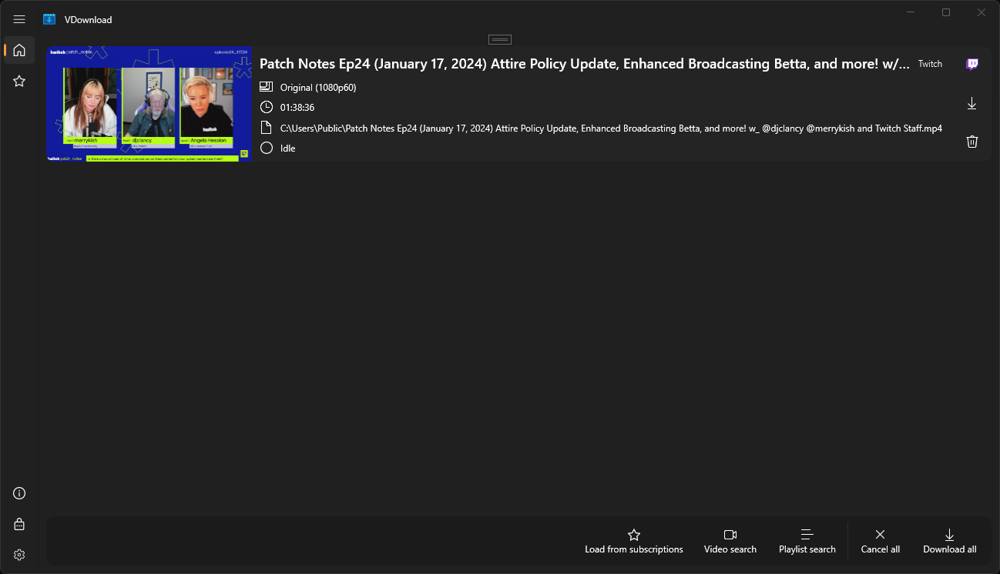

# VDownload
VDownload is universal video downloader written in .NET/C# and Universal Windows Platform.

## Requirements
- Windows 11

## Download and installation
- GitHub Releases
- Microsoft Store (in the future)

## Features and supported sources

#### Supported sources
- Twitch (VODs, clips and channels)

#### Features

- Intuitive and easy to use
- Modern GUI, consistent with Windows, touchscreen friendly
- Multiple video service support - one app for all
- Video downloading
- Audio-only, video-only and audio-video downloading
- Time trimming - download only the fragment you need
- Playlist downloading
- Playlist filtering - download only the videos you need
- Playlist subscription - download new videos from saved playlists
- Downloading queue
- FFmpeg transcoding
- Highly configurable - from default video downloading parameters to transcoding options

and all of this for free

## App development

VDownload is a project, which I develop in my free time as a hobby and a form of learning.

As the application is not 100% resistant to external factors (e.g. changes in services APIs) and to be fair to creators and video services, it is available for free with open source code. 

If you want to support me and the development of the project you can:
- **Donate me** via Paypal (link in the "Sponsor this project" section in Github repository and in the app itself in the "About" page)
- **Report bugs and errors** in the "Issues" section of Github repository
- **Propose new features and support of video services** in the "Issues" section of Github repository
- **Translate the application into a language you know** 
